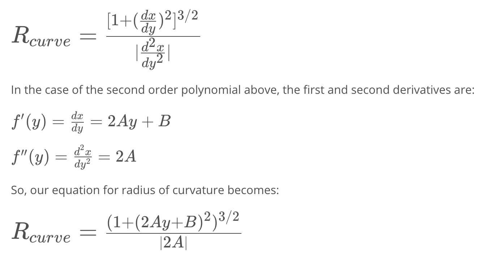

## Advanced Lane Finding Project

### Overview

---

The goals / steps of this project are the following:

* Compute the **camera calibration** matrix and distortion coefficients given a set of chessboard images.
* Apply a **distortion correction** to raw images.
* Use color transforms, gradients, etc., to **create a thresholded binary image.**
* Apply a **perspective transform** to rectify binary image ("birds-eye view").
* Detect lane pixels and fit to **find the lane boundary**.
* **Determine the curvature** of the lane and vehicle position with respect to center.
* Warp the detected lane boundaries back onto the original image.
* Output visual display of the lane boundaries and numerical estimation of lane curvature and vehicle position.


This scheme is implemented using OpenCV in the python package. The algorithm and detail description are written in the [Jupyter notebook](./P2-Advanced_lane_lines.ipynb).

[//]: # "Image References"

[image1]: ./examples/undistort_output.png "Undistorted"
[image2]: ./test_images/test1.jpg "Road Transformed"
[image3]: ./output_images/combined_binary.jpg "Binary Example"
[image4]: ./output_images/warped.png "Warp Example"
[image5]: ./examples/color_fit_lines.jpg "Fit Visual"
[image6]: ./output_images/test1.jpg "Output"
[video1]: ./project_video.mp4 "Video"

---

### Camera Calibration

I start by preparing "object points", which will be the (x, y, z) coordinates of the chessboard corners in the world. Here I am assuming the chessboard is fixed on the (x, y) plane at z=0, such that the object points are the same for each calibration image.  Thus, `objp` is just a replicated array of coordinates, and `objpoints` will be appended with a copy of it every time I successfully detect all chessboard corners in a test image.  `imgpoints` will be appended with the (x, y) pixel position of each of the corners in the image plane with each successful chessboard detection.  

I then used the output `objpoints` and `imgpoints` to compute the camera calibration and distortion coefficients using the `cv2.calibrateCamera()` function.  I applied this distortion correction to the test image using the `cv2.undistort()` function and obtained this result: 

![alt text][image1]

### Pipeline (single images)

#### 1. Distortion-corrected image.

To demonstrate this step, I will describe how I apply the distortion correction to one of the test images like this one:
![alt text][image2]

#### 2. Thresholded binary image.  

I used a combination of color and gradient thresholds to generate a binary image.  The original image is converted into **HLS**(`hls = cv2.cvtColor(img, cv2.COLOR_RGB2HLS)`) space and gradient in *x* direction is taken on the gray image by **Sobel operator**(`sobelx = cv2.Sobel(gray, cv2.CV_64F, 1, 0)`).  Each threshold for gradient and color channel are properly chosen and pixels are stored as a binary. Finally, combined binary image is obtained by *or* operation. Here's an example of my output for this step. 

![alt text][image3]

#### 3. Perspective transform.

The `cv2.getPerspectiveTransform()` function takes as inputs source (`src`) and destination (`dst`) points. It returns a transform matrix `M`. The transform matrix is used for warping a image using the `cv2.warpPerspective()` function, which takes as inputs image image source and transform matrix.  I chose the hardcode the source and destination points in the following manner:

```python
ylim = img.shape[0]
xlim = img.shape[1]
# Four source coordinates
src = np.float32(
    [[xlim/2-438,ylim],
     [xlim/2-40,448],
     [xlim/2+40,448],
     [xlim/2+438,ylim]])
# Four desired coordinates
offset = 300
dst = np.float32(
    [[offset,ylim],
     [offset,0],
     [xlim-offset,0],
     [xlim-offset,ylim]])
```

This resulted in the following source and destination points:

|  Source   | Destination |
| :-------: | :---------: |
| 202, 720  |  300, 720   |
| 320, 448  |   300, 0    |
| 400, 448  |   980, 0    |
| 1078, 720 |  980, 720   |

Following images show the original binary image and warped image respectively. On the warped image, the line polynomials are drawn with yellow. The next section will describe how to find the lines from binary pixels.

![alt text][image4]

#### 4. Fit polynomial

First of all, the dominant pixel is obtained by choosing maximum histogram point. Point that has maximum histogram is likely to be a lane line. The point is chosen for the base point. Height of image is divided by the number of windows. On the each window, non-zero pixels are taken near the base point that was chosen previously.

Using these pixels, polynomial of the line is fitted using the `np.polyfit()` function. Fitted curve depicted in the warped binary image is shown below.


![alt text][image5]

#### 5. Determine the Curvature of the Lane and Position of the Vehicle.

* Curvature of the lane

  In order to transform from the pixel frame to the real world frame, Conversions in x and y from pixels pace need to be defined. In my case, following conversion factor is defined.

  ```python
  ym_per_pix = 30/720 # meters per pixel in y dimension
  xm_per_pix = 3.7/700 # meters per pixel in x dimension
  ```

  After applying dimension conversion, the curvature of the line is calculated by following equation:

  <figure>
      
       <!--  <figcaption>
          <p></p>
          <p style="text-align: center;">  </p>
      </figcaption> -->
  </figure>

  Points at the bottom of the image are used, which are the nearest point to the vehicle.

  

* Position of the vehicle

  Two points of left and right of lane are obtained respectively. Average of these two point can be the indicator of the position of the vehicle since we assumed that the camera is mounted at the center of the vehicle. Difference of this average value and the half of the size in x direction is the displacement of the vehicle from the center of the lane. By multiplying conversion parameter, vehicle position in meter can be calculated. The code is as follow.

  ```python
  # Calculate vehicel position respect to the center of the line
  dis = 1280/2 - (leftx[0]+rightx[0])/2
  dis = dis*xm_per_pix
  ```


#### 6. Example of result image

I implemented above each steps in a single function, and finally a function `lane_detection()` gives result image that contains identified lane region. It takes a original image source. The radius of curvature of the lane and vehicle position are written on the image. The result of test image is shown below.

![alt text][image6]

---

### Pipeline (video)

All of image processing steps are the same with the pipeline of image. Because a video is simply series of images, `lane_detection()` function can be simply used. See the function `process_image()`, moviepy.editor package is used.

Here's a [link to my video result](./output_videos/project_video.mp4)

---

### Discussion

#### 1. Briefly discuss any problems / issues you faced in your implementation of this project.  Where will your pipeline likely fail?  What could you do to make it more robust?

There is a lot of parameters that need to be tuned. They should be somewhat different on different environments. Adaptively varying parameters can show more robust in various situations.